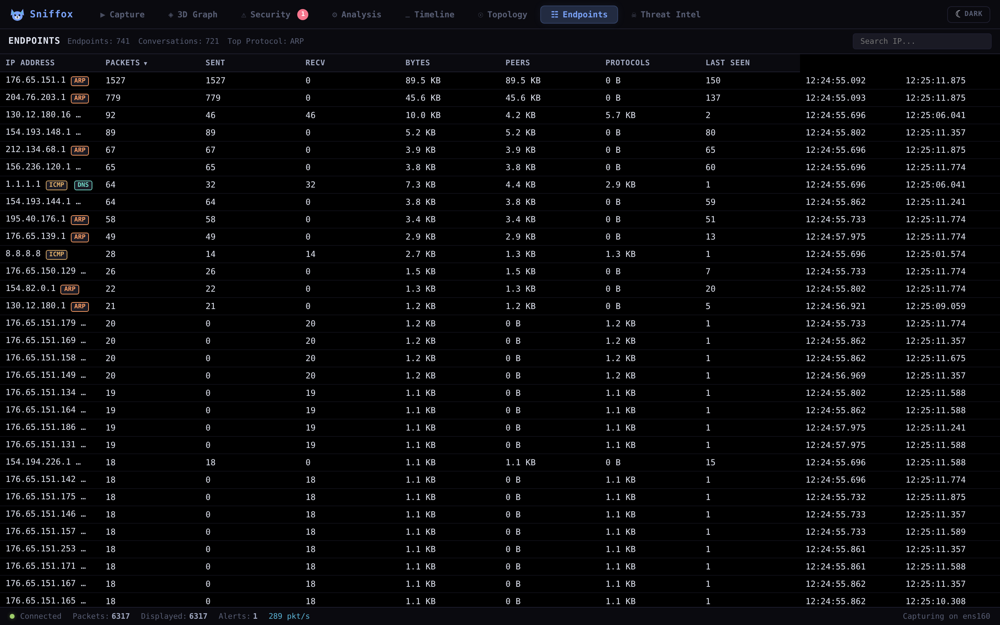
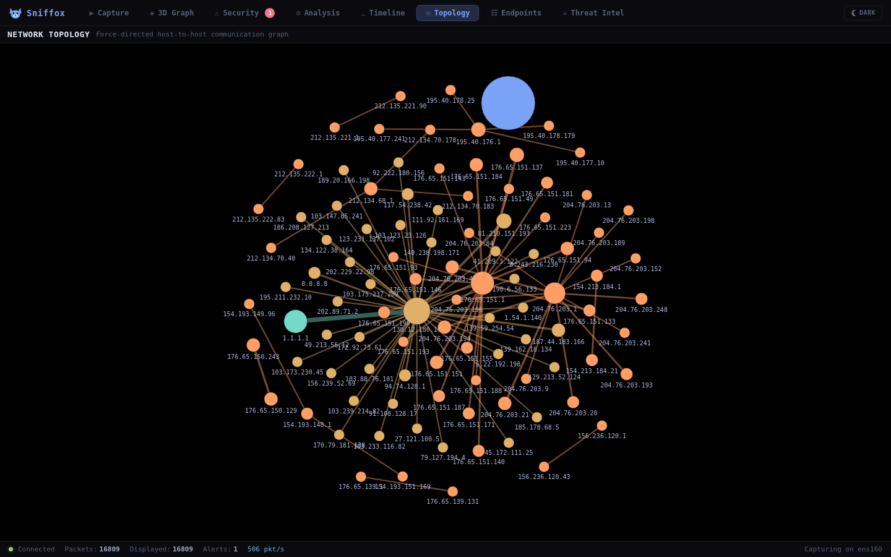
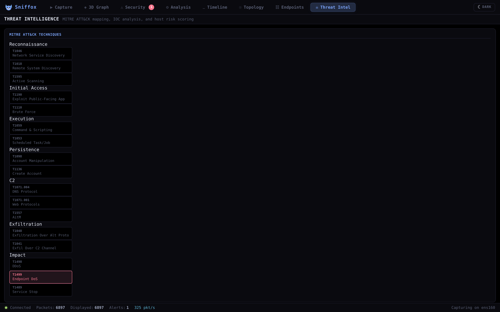
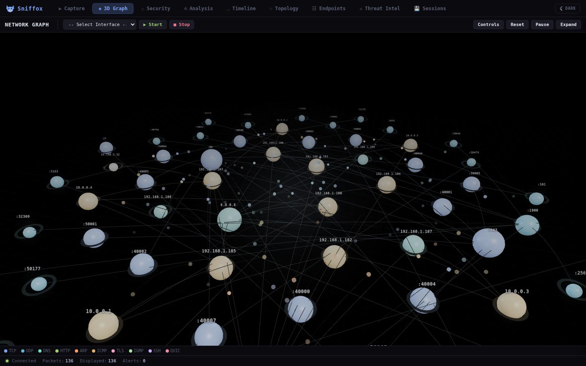

# Sniffox 🦊

Real-time packet analyzer that runs in your browser. Capture traffic, tear packets apart, visualize connections, spot threats — all from a single tab.

Go backend with an embedded web UI. No Electron, no desktop app. Visualize your servers entire network from within the browser.


## Get Running

```bash
sudo apt-get install -y libpcap-dev
go build -o sniffox .
sudo ./sniffox --port 8080
```

Hit `http://localhost:8080`, pick an interface, and start sniffing.

## What It Does

**Capture & Analysis** — Sniff live traffic with BPF filters or drop in a PCAP file. Parses 24 protocols (Ethernet, ARP, IPv4/v6, TCP, UDP, ICMP, ICMPv6, DNS, HTTP, TLS, DHCP, NTP, VLAN, IGMP, GRE, SCTP, STP + heuristic detection for SSH, QUIC, MQTT, SIP, Modbus, RDP). Wireshark-style three-pane layout with virtual scrolling and a right-click context menu.

**Deep Packet Inspection** — Click into any packet to see protocol layers, hex dump, byte distribution heatmap, Shannon entropy, payload decoding, and JSON/hex export.


**Display Filters** — Boolean logic (`tcp && !dns`), IP/port matching (`ip==10.0.0.1`, `port==443`), TLS inspection (`tls.sni==example.com`), direction filters (`inbound`, `outbound`, `broadcast`), flow/stream filters (`flow==1`, `stream==1`).


**Endpoints** — Per-IP stats: sent/received packets and bytes, peer count, protocol badges, first/last seen timestamps. Sortable and searchable.



**Flow Tracking** — Groups packets into connections with a sortable flow table. Per-flow stats, TCP state machine tracking (SYN_SENT through CLOSED), directional packet/byte counts. Click any flow to filter down to its packets.


**TCP Stream Reassembly** — Reconstructs the full byte stream. "Follow TCP Stream" shows client/server data in alternating colors with ASCII/Hex/Raw views and pulls out HTTP request/response pairs automatically.

**Topology** — Force-directed graph of who's talking to who. Physics sim, draggable/pinnable nodes, edge thickness scales with packet count, colored by dominant protocol.



**Threat Intel** — MITRE ATT&CK mapping grid, IOC tracking, per-host risk scores with color bands, and geo-IP classification.




**3D Network Graph** — Three.js viz where IPs are nodes and packets fly between them as animated particles. Protocol color-coding, fullscreen, IP search, live stats. Falls back gracefully when WebGL isn't available.



## Project Layout

```
internal/
  models/      Packet & message types
  capture/     Live capture + PCAP reader
  parser/      Protocol extraction (24 protocols + JA3)
  flow/        Flow tracking + TCP state machine
  stream/      TCP reassembly + HTTP extraction
  engine/      Session manager, broadcast, protocol stats
  handlers/    HTTP routes, WebSocket

web/static/
  js/          app, router, packetlist, packetdetail, hexview, filters,
               flows, streams, view3d, security, packetmodal, timeline,
               topology, endpoints, threatintel, sessions, bookmarks,
               commandpalette
  css/         Dark / Dim / Light themes
```

## Dependencies

[gopacket](https://github.com/google/gopacket) for packet capture, [gorilla/websocket](https://github.com/gorilla/websocket) for WebSocket, [Three.js](https://threejs.org/) r128 for the 3D stuff.
